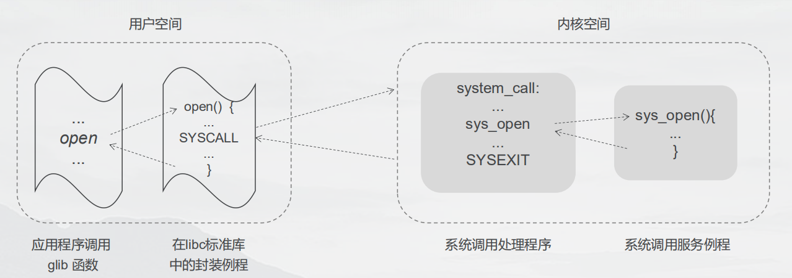

## 一 系统调用概述

操作系统以API形式提供了一系列的服务供程序访问，如：创建新进程、执行 I/O，以及为进程间通信创建管道等。系统调用即应用程序借助这些系统提供的API，请求内核执行底层动作。  

系统调用示例图：  
 

内部请求转达图：  
  

系统调用的注意点：
- 系统调用将处理器从用户态切换到内核态，以便 CPU 访问受到保护的内核内存
- 系统调用的组成是固定的，每个系统调用都由一个唯一的数字来标识
- 每个系统调用可辅之以一套参数，对用户空间（亦即进程的虚拟地址空间）与内核空间之间（相互）传递的信息加以规范

## 二 为什么需要系统调用

- 把用户从底层硬件编程中解放出来，降低开发难度
- 提高安全性，因为用户进程与内核进行了隔离
- 统一的开放接口可以使用户程序具备了可移植性，适应不同平台不同硬件

## 三 系统调用的实现

Linux软件中断（软件指令触发的中断）实现了系统调用，Linux内核会响应软件中断，从用户态切换到内核态，然后执行相应的系统调用。  

系统调用的步骤：
- 1 应用程序通过调用 C 语言函数库中的外壳（ wrapper）函数，来发起系统调用
- 2 通过堆栈，外壳函数的参数被复制到寄存器
- 3 外壳函数将系统调用编号复制到一个特殊的CPU寄存器（%eax）中，这样才能让内核区分是哪个系统调用
- 4 外壳函数执行一条中断机器指令（int0x80），引发处理器从用户态切换到核心态，并执行系统中断 0x80 (十进制数 128)的中断矢量所指向的代码。
  - 贴士： 2.6 内核及 glibc 2.3.2 以后的版本持 新指令 sysenter
- 5 为响应中断 0x80，内核会调用 system_call()例程（位于汇编文件 arch/i386/entry.S 中）来处理该次中断，内部处理过程为：
  - 在内核栈中保存寄存器值
  - 审核系统调用编号的有效性
  - 查找所有服务历程列表（sys_call_table），找到系统调用编号对应的服务例程，执行必要的操作后将结果装填返回给system_call()例程
  - 从内核栈中恢复各寄存器值，并将系统调用返回值置于栈中
  - 返回至外壳函数，同时将处理器切换回用户态
- 6 若系统调用服务例程的返回值表明调用有误， 外壳函数会使用该值来设置全局变量 errno，然后，外壳函数会返回到调用程序，并同时返回一个整型值，以表明系统
调用是否成功。  

如下图所示execve调用系统调用执行过程：  

 

## 四 常见的实现系统调用库

#### 4.1 glibc

glibc是Linux下的开源标准C库，提供的库函数可以发起系统调用。  
- 每个特定系统调用都对应了至少一个glibc封装的库函数
- 多个API也可能只对应一个系统调用
- 返回值-1在大多数情况下表示内核不能满足进程请求
- Libc中定义的errno变量包含特定的出错码

示例：
```c
#include <sys/types.h>
#include <sys/stat.h>
#include <errno.h>
#include <stdio.h>

int main() {
    int rc;
    rc = chmod("./test.txt", S_IWUSR | S_IWGRP | S_IWOTH);
    if (rc == -1) {
        fprintf(stderr, "chmod failed, errno = %d\n", errno);
    } else {
        printf("chomod success!\n");
    }
    return 0;
}
```


#### 4.2 syscall

glibc也提供了 `syscall` 函数直接调用系统调用。  

函数原型：`long int syscall(long int sysno, ...);`
- sysno 是系统调用号，参见 sys/syscall.h
- ... 为剩余可变长参数，根据系统调用的不同，可携带0-5个不等参数，超过该长度的参数将会被忽略
- 返回值为特定系统调用的返回值，失败返回-1，错误代码存放在errno中

示例：
```c
#include <sys/syscall.h>
#include <sys/stat.h>
#include <unistd.h>
#include <errno.h>
#include <stdio.h>

int main() {
    int rc;
    rc = syscall(SYS_chmod, "./test.txt", S_IROTH | S_IRGRP | S_IRUSR);
    if (rc == -1) {
        fprintf(stderr, "chmod failed, errno = %d\n", errno);
    } else {
        printf("chomod success!\n");
    }
    return 0;
}
```
 
#### 4.3 优劣

glibc函数：更加上层，只需要使用api即可调用，不必知道调用号等细节，但是没有封装某个内核提供的系统调用时无法使用
syscall调用：可定制自己的系统调用，但是使用不方便

实践：
- 频繁使用底层系统调用会影响程序效率（因为用户态与内核态切换）
- 多用glibc库，尽可能少调用系统接口
